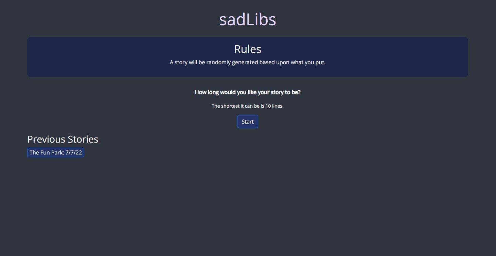
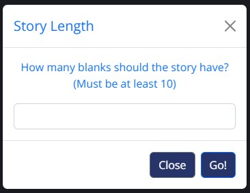
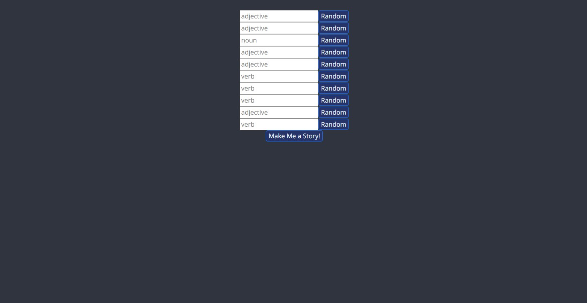

# sadLibs
The idea of this project, is to create a satirical version of an ad lib creator. The target audience is you, the person seeking entertainment. 

## How To Play sadLibs
1. Click on the __start__ button. (Figure 1)
2. Enter a desired number that's _10 or higher_, so the story can generate inputs based on the given number. (Figure 2)
3. Adlib with the given blanks (enter whatever word that corresponds with the place holder), or click on the random button to generate a random adlib. (Figure 3)
4. Click on __Make A Story For Me!__ button to see the story.
5. Enjoy reading the adlib story.

**Note**: sadLibs can be great content that encourages kids to be creative. Read the story and send it to someone for a laugh or if you need a nice, fun way to give a bedtime story. 

## Programming Languages And APIs Used
* HTML
* CSS + Bootstrap
* JavaScript
* [Madlibz API](https://madlibz.herokuapp.com/api)
* [WordsAPI](https://www.wordsapi.com/docs/#introduction)

## How sadLibs Looks
Figure 1: This is what user will see first when they launch sadLibs. They can also see their previous story has been saved. (If they did not make a story before, the previous stories section will not appear.)

Figure 2: Once user clicks on the start button. they receive this.

Figure 3: Adlib time!

Figure 4: How the story is displayed.

## How To Deploy sadLibs
1. Click [here](https://github.com/mike-gonz0/sadLibs) to go to the respository on GitHub.
2. Clone it to your computer.
3. Find the `index.html` in the `sadLibs` directory.
4. Then run the `index.html` to see the sadLibs website, which should look like [this](https://mike-gonz0.github.io/sadLibs/).